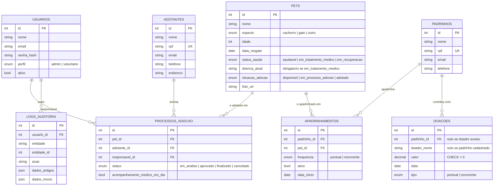

# Modelo de dados da PetMeet

## Constraints e indices relevantes (RNF07)

| Tabela | Constraint/Indice | Motivo |
|---|---|---|
| `usuarios.email` | UNIQUE + indice | login por email precisa ser rapido e sem duplicatas |
| `adotantes.cpf` / `padrinhos.cpf` | UNIQUE + indice | evita cadastro duplicado da mesma pessoa |
| `pets.situacao_adocao` / `pets.status_saude` | indice | filtros de listagem mais usados (RF05) |
| `apadrinhamentos (padrinho_id, pet_id)` | UNIQUE | mesmo padrinho nao apadrinha o mesmo pet duas vezes |
| `processos_adocao (pet_id) WHERE status='finalizado'` | UNIQUE parcial | **RN02/RF17**: um pet, no máximo, um processo finalizado |
| `doacoes.valor` | CHECK `valor > 0` | **RN05**, reforçada tambem no schema Pydantic |
| `doacoes.data` | indice | consultas por período (RF13) |

## Por que `doenca_atual` e `acompanhamento_medico_em_dia` existem

Essas duas colunas sustentam diretamente a regra crítica RN01/RF16:

- `Pet.doenca_atual` — obrigatório sempre que `status_saude` for
  `em_tratamento_medico` (validado no schema Pydantic e reforçado no serviço).
  É o "identificar qual doença está sendo tratada" citado no RF16.
- `ProcessoAdocao.acompanhamento_medico_em_dia` — **histórico**. Na versão
  recebida, marcar o acompanhamento em dia liberava a finalização de um pet em
  tratamento. Com a decisão D1 a regra passou a ser literal — pet em tratamento
  não finaliza, sem exceção — e o campo deixou de ser lido. A coluna fica para
  não apagar o registro dos processos finalizados antes da mudança.
